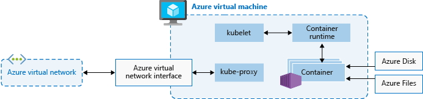

# Learn Kubernetes Basics

Guide to [Kubernetes](https://kubernetes.io/docs/tutorials/kubernetes-basics/)

## Kubernetes Clusters

Kubernetes coordinates a highly available cluster of computers that are connected to work as a single unit. Applications runs on containers, and containers are manipulated by Kubernetes, which automate the distribution and scheduling of application containers across a cluster in an efficient way. 

A **Kubernetes cluster** has two types of resources:
 - **Control Plane**: 
   - Coordinates the cluster
 - **Nodes**: 
   - Actual workers that run the applications in node processes.
   - A Kubernetes cluster has at least three nodes to ensure redundancy
   - Each node is a VM or a physical computer that serves as a worker machine in a Kubernetes cluster.
   - Every Kubernetes Node runs at least:
        - **Kubelet**, a process responsible for communication between the Kubernetes control plane and the Node; it manages the Pods and the containers running on a machine.
        - A container runtime (like Docker) responsible for pulling the container image from a registry, unpacking the container, and running the application.

**Note:** All Kubernetes are defined using YAML (preferred) or JSON files.
  
When applications are deployed, the user tells the control plane to start the application containers. The control plane then schedules the containers to run on the cluster nodes. Nodes communicate back to the control plane through the **Kubernetes API** that the control plane exposes.

**Aside:** Minikube is a lightweight Kubernetes implementation that creates a VM on the local machine and deploys a simple cluster containing of only one node.

## Deployment

Once a Kubernetes cluster is created, applications which are to be deployed are specified in the Kubernetes **Deployment configuration**. This configuration tells Kubernetes how to create as well as *update* instances of the application. 

Once application instances are deployed, a Kubernetes **Deployment Controller** continuously monitors the instances. If an instance goes down, the Deployment Controller automatically schedule a new instance to be run (allowing a **self-healing mechanism** to deal with machine failure or maintenance). This functionality marks a step from previous deployment strategies, in which only an installation script is provided but no recovery process is established at the start.

Scaling is accomplished by changing the number of replicas in a Deployment

### Kubectl

Kubernetes offers **Kubectl**, which is the command line interface that uses the Kubernetes API to interact with the cluster. Common commands include:

- kubectl get - list resources
- kubectl describe - show detailed information about a resource
- kubectl logs - print the logs from a container in a pod
- kubectl exec - execute a command on a container in a pod


## Pods

When a Deployment configuration is created, Kubernetes also create a **Pod** to host the application instance. A Pod is an abstraction that represents of a group of one or more application containers and some shared resources for those containers (which can include shared storage, network, information how to run each container, etc.). The Pod is often used to contain different application containers which are relatively tightly coupled.

Pods are the **atomic unit** on the Kubernetes platform. Each Pod is tied to the Node where it is scheduled, and remains there until termination or deletion. A Node can have multiple pods.

Pods have a lifecycle, which expires when a worker node dies. A **ReplicaSet** might then dynamically drive the cluster back to a desired state via creation of new Pods to keep the application running. For example, a cluster may be running with multiple replicas of the same pod (this is an abstracted away in the front end). The ReplicaSet is responsible for reconciling changes among Pods so that the application continues to function and dealing with failures.

Also it's important to not that each Pod in a Kubernetes cluster has a unique IP address (even among Pods in the same Node). Although each Pod has a unique IP address, those IPs are not exposed outside the cluster without a **Service**.

## Service

A **Service** in Kubernetes which defines a logical set of Pods and a policy by which to access them. Services are the abstraction that  pods to die and replicate in Kubernetes without impacting the application. Services allows loose coupling between dependent pods (interconnection at even a higher level than just images *within* a Pod). The set of Pods targeted by a Service is usually a *LabelSelector*. 

A Service routes traffic across a set of Pods. Discovering and routing among dependent Pods (such as frontend and backend of an application) is handled by Kubernetes Services.

Services match a set of Pods using labels and selectors, a grouping primitive that allows logical operation on objects in Kubernetes. Labels are key/value pairs attached to objects and can be used in any number of ways:
 - Designate objects for development, test, and production
 - Embed version tags
 - Classify an object using tags

## Kubernetes core concepts for Azure Kubernetes Service (AKS)

Link to Microsoft [guide](https://docs.microsoft.com/en-us/azure/aks/concepts-clusters-workloads)

As application development continues to move towards a container-based approach, there is an increasing need to be able to reliably orchestrate and manage resources. Kubernetes provides a reliable scheduling of fault-tolerant application workloads. Building on top of htat, Microsoft's **Azure Kubernetes Service (AKS)** is a managed Kubernetes offering that further simplifies container-based application deployment and management.

### Kubernetes 

Kubernetes allow for running modern, portable, microservices-based applications with managed orchestration and ensured available of application components. It supports both stateless and stateful applications.


The Control Plane, which is provided at no cost as a managed Azure resource, provides the following Kubernetes components:
- kube-apiserver: Allowing exposing underlying Kubernetes API
- etcd: maintain state of Kubernetes cluster and configuration
- kube-scheduler: Scheduler determines what nodes can run workload and starts them. Manages scaling and creation of applications
- kube-controller-manager: The Controller Manager oversees a number of smaller controllers, of which are responsible for things like replicating pods and handling node actions.

Within each node there are:
- `kubelet`: Kubernetes agent that processes orchestration requests from control plane along with being responsible for scheduling and running requested containers
- kube-proxy: Handles the virtual networking on each node. Routes network traffic and manages IP addressing for the services and pods
- container runtime: Allow containerized applications to run and interact with additional resources like virtual network and storage.



## Quickstart on deploying AKS 

Link to Microsoft [guide](https://docs.microsoft.com/en-us/azure/aks/learn/quick-kubernetes-deploy-portal)

When creating a Kubernetes cluster, we have the options to choose/define:
- Cluster types + presets (to optimize for performance/cost)
  - Notably I saw the most popular basic option was completely out across many different regions (in US, Europe, etc.)
- Node pools
- Resource identity
  - Either system-assigned managed identity by default or other service principals or even Azure AD

To connect to the Kubernetes cluster, we use the Kubernetes CLI, `kubectl`. In Azure this is made available through the Azure Cloud Shell.

The following command connects to the Kubernetes cluster (by first downloading credentials and configures Kubernetes CLI to use them):

`az aks get-credentials --resource-group myResourceGroup --name myAKSCluster`

`kubectl get nodes` shows list of cluster nodes. Sample output is:

```text
NAME                                STATUS   ROLES   AGE   VERSION
aks-agentpool-12345678-vmss000000   Ready    agent   23m   v1.19.11
aks-agentpool-12345678-vmss000001   Ready    agent   24m   v1.19.11
```

To create the sample Azure Vote application, they first define the **manifest YAML** file that creates all objects needed to run the app. This includes two separate deployments of:

- Azure Vote python application (front-end)
- Redis instance (back-end)
  - Note: Redis is an open-source database

For these the manifest specifies the image (ex. `mcr.microsoft.com/oss/bitnami/redis:6.0.8` for the Redis and `mcr.microsoft.com/azuredocs/azure-vote-front:v1` for the Azure Vote app). They also provide limits on the CPU and memory that the containers can take up.

Two Kubernetes Services are also created, which defines:

- An internal service for Redis instance
- An external service to access the Azure Vote application from the Internet

They then deploy the application using `kubectl apply` and specify the name of the YAML manifest.

After the application has been created / deployed, we can monitor one of the service (say the front-end) with `kubectl get service azure-vote-front --watch`, which will return something like:

`azure-vote-front   LoadBalancer   10.0.37.27   52.179.23.131   80:30572/TCP   2m`

This also lets us know the public IP, which we can use to browse to view out Azure Voting app.

Continuing steps: Learning to work with a multi-container application. Link to guide: <https://docs.microsoft.com/en-us/azure/aks/tutorial-kubernetes-prepare-app>

